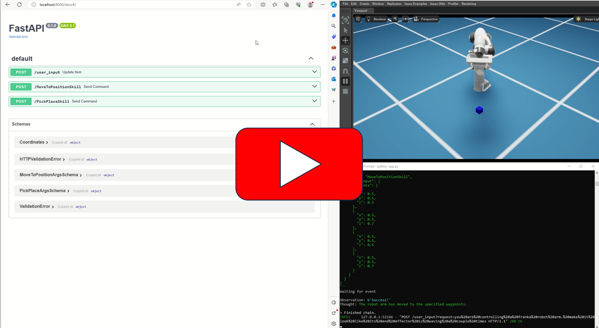

## Demo

## Installation
1. Deploy an Omniverse Virtual Workstation on AWS: https://docs.omniverse.nvidia.com/nucleus/latest/enterprise/cloud_aws_vdi.html
2. Download this repository
3. Create OpenAI API token
4. Create .env file in src\equilibration\agents with `OPENAI_API_KEY={your token here}"`
4. pip install requirements.txt
5. Run app.py from src\equilibration
